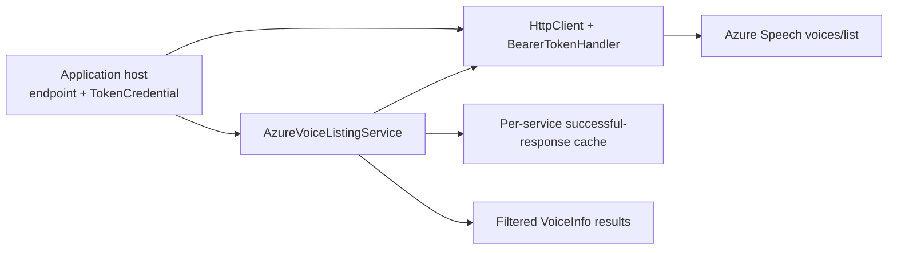
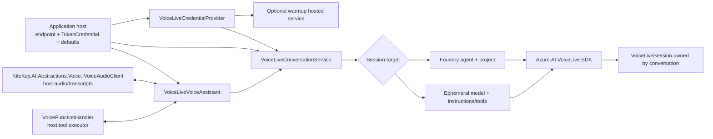

# Azure AI extraction architecture

## Speech voice discovery

The host supplies an absolute HTTPS endpoint, HTTP transport, credential, and logger. Discovery tries the Azure AI Services TTS endpoint first and the legacy Cognitive Services path second; failures are not cached. The host chooses the credential source, including managed identity or workload identity. No credentials or application settings are included in packages.

## Voice Live sessions

The conversation service applies per-call `VoiceSessionSettings` overrides to host-provided defaults, validates voice/VAD values, lazily creates a Voice Live client, and disposes its session. The assistant pipes microphone input into the session, routes synthesized audio and transcript updates to a host-provided transport, handles user barge-in, sends function results back to Voice Live, and terminates both concurrent loops on disconnect. The host retains Azure Functions triggers, application-specific agent lookup, tool execution, audio I/O, credentials, and environment-based registrations.

## Extraction boundary

Migrated and adapted from the Delphinium AI library:

| Package | Original source files |
| --- | --- |
| KiteKey.AI.Azure | `Voice/AzureVoiceListingService.cs`, `Voice/BearerTokenHandler.cs` |
| KiteKey.AI.Azure.VoiceLive | `Voice/VoiceLiveVoiceAssistant.cs`, `Voice/VoiceLiveConversationService.cs`, `Voice/VoiceLiveCredentialProvider.cs`, `Voice/VoiceLiveCredentialWarmupService.cs`, `Voice/VoiceSessionSettings.cs`, `Voice/EphemeralFunctionTool.cs` |

The VoiceLive package depends on the published `KiteKey.AI.Abstractions` 0.1.0 package for `IVoiceAudioClient`, `VoiceTranscript`, and `VoiceToolCall`. The package-local `VoiceFunctionHandler` and `VoiceFunctionResult` remain specific to handling Voice Live function results. The host maps its own transcript entity to `VoiceTranscript` and implements the shared audio interface; no Delphinium domain entity or settings/config file is shipped. CI restores the package from NuGet.org, not a sibling-project reference.

The assistant addition advances `KiteKey.AI.Azure.VoiceLive` from the initial `0.1.0` CI artifact to `0.2.0`; `KiteKey.AI.Azure` remains `0.1.0`. Neither version has been published here.

### API migration from Delphinium

| Previous API/behavior | New Azure package API/behavior |
| --- | --- |
| `VoiceLiveVoiceAssistant` required `IFunctionExecutor`, `IAssistantService`, and `IOptions<AzureAISettings>` | Constructor takes `VoiceLiveConversationService`, logger, and optional `VoiceFunctionHandler` delegate; host maps its executor and conversation ID to this delegate. |
| `StartConversation(assistantId, IHumanAudioClient, allowInterrupts, cancellation, initialMessage, settings)` | `StartConversationAsync(IVoiceAudioClient, allowInterrupts, assistantId, settings, cancellationToken)`. The previously ignored `initialMessage` and unsupported `threadId` overload are removed. |
| Delphinium `IHumanAudioClient` sent `ConversationTranscriptMessage` | Implement `KiteKey.AI.Abstractions.Voice.IVoiceAudioClient.SendTranscriptAsync(VoiceTranscript, ...)` and map fields in the host. `VoiceToolCall` holds optional tool details; this package does not depend on the host's persistence model. |
| Hard-coded host context keys and a native stop-function handler | Host receives `conversationId` in `VoiceFunctionHandler` and chooses its own trusted context keys. Return `VoiceFunctionResult(..., EndConversation: true)` for a farewell. |
| Assistant disposed audio client and exposed thread/initial-message parameters that did not work | Host retains audio-client ownership; assistant owns a single conversation and disposes its session. |

Deferred: Delphinium `IVoiceAssistant`, `IHumanAudioClient`, `ConversationTranscriptMessage`, other agent/assistant/chat services, app settings/config files, Azure Functions host, and application credential registrations remain in Delphinium. They require a host-side adapter when Delphinium is integrated with the new packages.

## Build and publishing

CI restores, tests, and packs both source packages independently of the Delphinium repository. The separate **manual-only** `publish.yml` workflow uses NuGet Trusted Publishing via GitHub OIDC (`id-token: write`) instead of stored API keys. The NuGet.org trusted-publishing policy must match GitHub owner `Kite-Key`, repository `azure`, workflow `publish.yml`, and environment `nuget`. **The `NuGet/login` `user` is the NuGet.org account that created that policy (`taylorchasewhite`), not the package's organization owner (`KiteKey`).** The repository variable `NUGET_USER` is set to the policy creator; if the policy is recreated by another account, update that variable to match.

Each package is versioned and released independently (`KiteKey.AI.Azure` currently 0.1.0; `KiteKey.AI.Azure.VoiceLive` currently 0.2.0). For a **future** version, update only the selected project's `<Version>`, merge and verify CI on `main`, then create a tag named `<PackageId>-v<Version>` at that commit (for example `KiteKey.AI.Azure-v0.2.0` or `KiteKey.AI.Azure.VoiceLive-v0.3.0`). After parent review, manually dispatch `publish.yml` **on that tag** with the matching package and `expected_version` inputs and the confirmation checkbox. The workflow rejects branch dispatches, mismatched tags or project versions, tags not on `main`, and versions already indexed on NuGet.org; it packs and pushes only the selected package without `--skip-duplicate`. A simultaneous publisher can still win the indexing race, in which case NuGet.org rejects the duplicate push. Protect the `nuget` environment with approval rules. No tag or NuGet publication is performed by ordinary build/CI.
