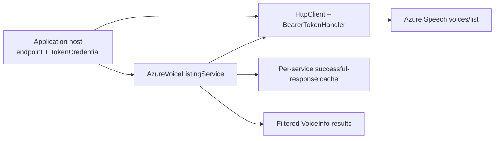
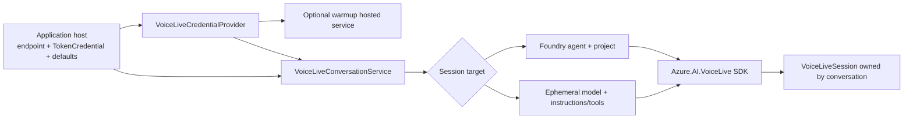

# Azure AI extraction architecture

## Speech voice discovery

The host supplies an absolute HTTPS endpoint, HTTP transport, credential, and logger. Discovery tries the Azure AI Services TTS endpoint first and the legacy Cognitive Services path second; failures are not cached. The host chooses the credential source, including managed identity or workload identity. No credentials or application settings are included in packages.

## Voice Live sessions

The service applies per-call `VoiceSessionSettings` overrides to host-provided defaults, validates voice/VAD values, lazily creates a Voice Live client, and disposes its session. The host retains Azure Functions triggers, application-specific agent lookup, tool execution, audio I/O, credentials, and environment-based registrations.

## Extraction boundary

Migrated and adapted from `ArtificialIntelligence/Delphinium.Services.ArtificialIntelligence`:

| Package | Original source files |
| --- | --- |
| KiteKey.AI.Azure | `Voice/AzureVoiceListingService.cs`, `Voice/BearerTokenHandler.cs` |
| KiteKey.AI.Azure.VoiceLive | `Voice/VoiceLiveConversationService.cs`, `Voice/VoiceLiveCredentialProvider.cs`, `Voice/VoiceLiveCredentialWarmupService.cs`, `Voice/VoiceSessionSettings.cs`, `Voice/EphemeralFunctionTool.cs` |

Deferred: `VoiceLiveVoiceAssistant.cs` and `IVoiceAssistant.cs` couple to Delphinium audio clients, function execution, and assistant services; agent/assistant/chat services depend on Delphinium entities and persistence; Delphinium settings/config files, the Azure Functions host, and all application credential registrations remain in Delphinium. The concurrently developed `KiteKey.AI.Abstractions` currently exposes chat/text/function contracts, not voice discovery or session contracts, so these packages do not force an unrelated abstraction dependency.

## Build and publishing

CI restores, tests, and packs both source packages independently of the Delphinium repository. The separate **manual-only** publish workflow uses NuGet Trusted Publishing via GitHub OIDC (`id-token: write`) instead of stored API keys; it requires explicit confirmation and should be protected with a GitHub `nuget` environment approval rule and matching NuGet.org trusted publisher policy before use. The package build does **not** publish.
